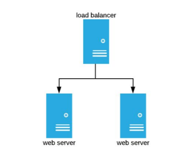

# Demonstration of Vagrant and Ansible-Built HA Web Servers with Proxy
====================================================================

## Overview:

This repository contains the files required to automatically build a two-server HA cluster of NGinx
backend servers with an NGinx front-end proxy. The aim is to provision the proxy to act as the front-
end gateway to both backend web servers, ensuring that if one fails the other will continue to present
pages. Each web server is configured identically, using Ansible to configure/provision all host options
while Vagrant is the engine which handles deployment.



## Technical Detail:

The repository is made up of the following files:

- Vagrantfile (build definition)
- Ansible inventory file (contains target hosts for Ansible)
- Ansible playbooks - one for the proxy and one for any number of backend web servers (default: 2)
- Playbook roles subfolders (located under provision/roles)

The Vagrantfile defines the build instructions for the base virtual machines. Ansible deploys each
machine's configuration individually by loading Ansible locally on each box and running the corresponding
playbook for each machine type. The results of the default configuration are:

- One proxy host running Nginx with an IP address of 10.0.0.10 (proxy). This machine forwards page requests
  to the two backend machines.
- One backend web server running Nginx with an IP address of 10.0.0.11 (host1).
- A second backend web server, also running Nginx with an IP address of 10.0.0.12 (host2).

## Deployment Tests
This deployment has been tested on both Linux and Windows 10 hosts. The Linux installation was very simple:

- Install Virtualbox
- Install Vagrant
- Download/install the code respository
- Run 'vagrant up'

The Windows deployment was somewhat more involved, depending on your setup. To run the deployment on
Windows 10, the following prerequisites **must** be met:

- Hyper-V must be either uninstalled or disabled.
- If you have installed Docker for Windows, this must also be disabled/uninstalled.
- Oracle Virtualbox must be the only hypervisor running on the system.
- Note: This virtual machine will **not** run on Hyper-V!

Unfortunately, I was unable to source a Macintosh host to test this on an OSX environment. However, it is
entirely likely that as long as the prerequiresites below are met, this deployment should work correctly on
a Mac.

## Prerequisites:

**Before downloading this repository, ensure your machine has the following installed:**

- Oracle Virtualbox - https://www.virtualbox.org/wiki/Downloads
- Vagrant - https://www.vagrantup.com/downloads.html

Follow the installation instructions on each site for your particular environment (Windows, Mac or Linux).

For performance, please ensure your machine is sufficiently powerful and has enough memory and disk
capacity to run three virtual servers.

## Installation and Running

To install this example, clone this repository to your own Linux machine:

```
git clone https://github.com/billhartcivica/vagranttest.git
```

Navigate to the newly downloaded folder:
```
cd vagranttest
```

Assuming you have met the technical requirements (installed Vagrant and Oracle Virtualbox), all that is
needed is to type the following and press Enter:
```
vagrant up
```

After a period of about 5 to 6 minutes, the server cluster should be up and running. Open your browser
and enter 'http://10.0.0.10' in the address bar and press <enter>. You should see the following:


NOTE: If you want to create more than the default two backend web servers, you can edit the 'Vagrantfile'
in this repository and amend the SERVER_COUNT value to whatever number of web servers you need.

## Further Technical Details:

The process of creating the cluster is as follows:

- Vagrant initiates the build, using the directives found in the Vagrantfile in the root of this repository.
- The Vagrantfile loops through a routine to set up the two backend web servers - host1 and host2. This is set
  by the variable SERVER_COUNT (default: 2) in the Vagrantfile. This can be amended to create further backend
  web servers, limited only by the resources available on your own computer. The system automatically creates
  a load-balancer config file with all the IP addresses of the deployed web servers.
- Each iteration of the webserver provisioning calls the same Ansible tasks in the corresponding role, defined
  in the provision/roles/webserver/tasks/main.yml file, including amending the default configuration,  installing
  PHP and copying the index.php file to the /usr/share/nginx/html folder.
- After each host is installed, local tests are run to check for the presence of the nginx service, the default
  listening port (80) and whether the expected 'Hello World' page is displayed. As each server is running Nginx
  and follows the same set of general rules, the tests defined are common to all. Because of this, the tests
  are defined in the provision/roles/common/tests/test.yml file.
- Next, the web proxy, is created and Ansible installed locally on that host as before.
- Ansible is started and the playbook for the proxy is run. This calls on the 'role' for the proxy held in the
  provision/roles/proxy folder which contains the tasks, the tests and the configuration files required to be
  copied to the host.
- The role's tasks (located in provison/roles/proxy/tasks/main.yml) define what changes are made to the
  host to configure it as the web proxy for the other two servers.
- Note: Tasks which are common to both the load balancer and the two web servers (installing nginx, updating
  the apt cache, amending the sudoers file and starting the service) are defined in the 
  provision/roles/common/tasks/main.yml file. 

## Folder Structure

```
├── hello.png                           # Image file for README.md
├── inventory                           # Ansible inventory of target hosts
├── provision                           # Top-level Ansible provision folder
│   ├── playbook-webserver.yml          # Ansible playbook for backend web hosts
│   ├── playbook.yml                    # Ansible playbook for frontend proxy
│   └── roles                           # Ansible roles
│       ├── common                      # Common role folder (common to proxy and web)
│       │   ├── defaults                # Default settings for provisioning
│       │   │   └── main.yml            # Config file for default settings
│       │   ├── files                   # Files to be uploaded to target (empty)
│       │   ├── handlers
│       │   │   └── main.yml
│       │   ├── meta
│       │   │   └── main.yml
│       │   ├── README.md               # README file for the common role
│       │   ├── tasks                   # Tasks common to both web and proxy
│       │   │   └── main.yml            # Tasks file for common tasks
│       │   ├── templates
│       │   ├── tests                   # Post-installation tests folder
│       │   │   ├── inventory           # Inventory file for tests
│       │   │   └── test.yml            # Tests defined for all hosts
│       │   └── vars
│       │       └── main.yml
│       ├── proxy                       # Proxy role folder
│       │   ├── defaults                # Default settings for provisioning
│       │   │   └── main.yml            # Config file for default settings
│       │   ├── files                   # Files to be uploaded to target
│       │   │   └── load-balancer.conf  # Load-balancer config for proxy
│       │   ├── handlers
│       │   │   └── main.yml
│       │   ├── meta
│       │   │   └── main.yml
│       │   ├── README.md               # README file for proxy role
│       │   ├── tasks                   # Tasks folder for proxy
│       │   │   └── main.yml            # Tasks file for proxy provisioning
│       │   ├── templates
│       │   ├── tests
│       │   │   ├── inventory
│       │   │   └── test.yml
│       │   └── vars
│       │       └── main.yml
│       └── webserver
│           ├── defaults                # Default settings for provisioning web server
│           │   └── main.yml            # Config file for default settings
│           ├── files                   # Files to be copied to the target host(s)
│           │   ├── default             # Default Nginx config file
│           │   ├── index.html          # Default web page
│           │   └── index.php           # Default web page for PHP handling (default)
│           ├── handlers
│           │   └── main.yml
│           ├── meta
│           │   └── main.yml
│           ├── README.md               # README file for web server role
│           ├── tasks                   # Tasks folder for web servers
│           │   └── main.yml            # Tasks file for web servers
│           ├── templates
│           ├── tests
│           │   ├── inventory
│           │   └── test.yml
│           └── vars
│               └── main.yml
├── README.md                           # README file for the repository
└── Vagrantfile                         # Config file for Vagrant deployment
```

## Additional Application(s)

As part of the exercise, I have included a very simple weather app, written in PHP and deployed on both web
servers. This can be accessed by entering the following in your browser navigation bar:
```
http://10.0.0.10/weather.php
```
This displays some current weather conditions in the London area.

## Things To Do

Given further time, I would prefer to automate the configuration of the load-balancer.conf file for the proxy
server, auto-populating the IP addresses for each backend web server. This would make the adding of extra web
hosts more dynamic and seamless.

Further improvements might be to deploy Nginx within a Docker container, running Docker on each web host and
on the proxy, configuring each using mapped configs to their respective internal configuration folders.

Taking containerisation further, another consideration might be to run the group as a Kubernetes cluster, with
proxy and web servers presented as orchestrated containers. This would allow for automatic scaling of both
backend web servers as well as the proxy, allowing the system to react more dynamically to web requests.

## Time Taken to complete

Overall, a total of roughly 8 and a half hours were spent over a period of days, taking an hour or so at a time.
